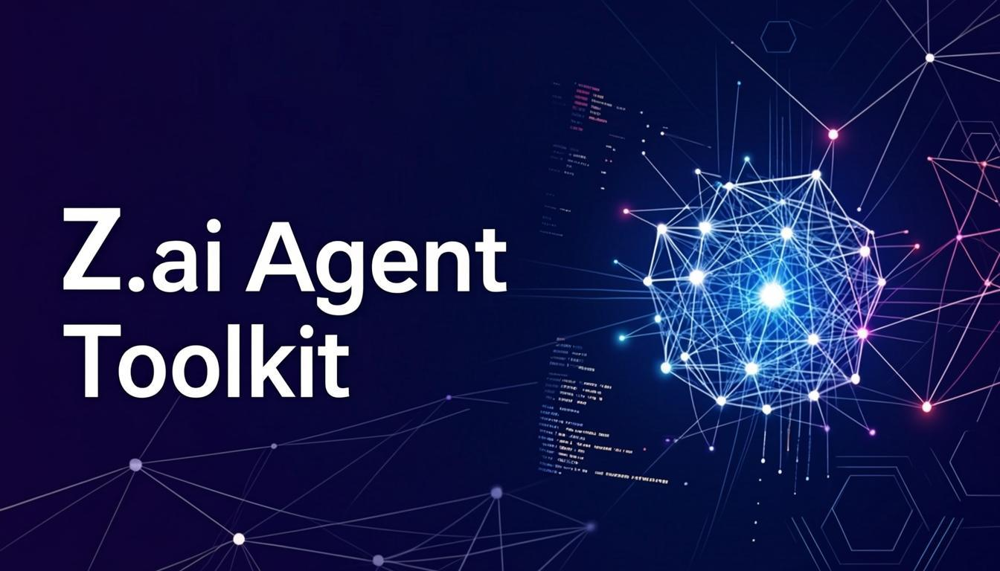

<p align="center">
  
</p>

# Agent Toolkit

[]()
[](https://opensource.org/licenses/MIT)
[]()

**Standards + Skills + Rules** for AI-driven development

> Toolkit version: **v1.8.3** | Language: **English**

---

## What Is This

Agent Toolkit is a self-contained set of governance documents, operational templates, and behavioral instructions that ensure AI agents produce consistent, clean, and reproducible code and documentation across projects.

It solves three problems:

1. **Inconsistency** -- different agents format code and docs differently
2. **Unicode pollution** -- emoji and Unicode symbols creeping into source code and docs
3. **Reproducibility** -- projects that break on clone because of hardcoded paths and missing env vars

---

## Quick Start

### Option A: Full Toolkit (recommended)

```bash
# Clone the toolkit
git clone https://github.com/stsgs1980/agent-toolkit.git

# Copy English standards and templates to your project
cp -r agent-toolkit/standards/*.md your-project/standards/
cp -r agent-toolkit/templates/          your-project/templates/
cp -r agent-toolkit/instructions/       your-project/instructions/
cp agent-toolkit/AGENT_RULES.md         your-project/
cp agent-toolkit/PROJECT_CONFIG.md      your-project/

# Edit PROJECT_CONFIG.md for your stack
```

### Option B: Standards Only

```bash
git clone https://github.com/stsgs1980/agent-toolkit.git
cp agent-toolkit/standards/*.md your-project/standards/
```

### Option C: Single Document

Download only the standard you need from the `standards/` directory.

---

## Implementation Order

**Do not apply standards randomly.** There is a mandatory 6-step sequence.

Each step builds on the previous one. Violating the order causes rework.

```text
Step 1: Accept Standards (Group B)      Read, understand, define stack
         |
         v
Step 2: Deploy Worklog (Group A)        Copy templates, verify against B
         |
         v
Step 3: REPRODUCIBILITY                 Configure env, DB, paths
         |                              Log to WORKLOG
         v
Step 4: Unicode Policy [C]           ESLint rule + UI code cleanup
         |                              Log to WORKLOG
         v
Step 5: MARKDOWN_STANDARD [W]           .md file cleanup (incl. Group A)
         |                              Log to WORKLOG
         v
Step 6: README_TEMPLATE                 Assemble README from template
                                        Log to WORKLOG
```

Full details: see `standards/IMPLEMENTATION_ORDER.md`

---

## Repository Structure

```text
agent-toolkit/
  AGENT_RULES.md              Behavioral rules for AI agents
  PROJECT_CONFIG.md           Project-specific settings (stack, server, paths)
  README.md                   This file

  assets/                     Visual assets
    logo.png                  Main logo (1024x1024)
    logo-banner.png           README banner (1344x768)
    favicon.png               Browser favicon (64x64)

  standards/                  Group B: Governance documents (apply first)
    MARKDOWN_STANDARD.md      Markdown formatting
    UNICODE_POLICY.md         Unicode/emoji prohibition
    README_TEMPLATE.md        Mandatory README structure
    REPRODUCIBILITY-STANDARD.md Clone + install + dev = works
    IMPLEMENTATION_ORDER.md   Implementation sequence
    STANDARD_ID_SYSTEM.md     Standard ID registry
    CODE_EXAMPLES_GUIDE.md    Code examples formatting
    FRONTEND_STANDARD.md      Frontend development
    GITHUB_STANDARD.md        Git/GitHub operations
    WCAG_2.1_AA_STANDARD.md   Accessibility WCAG 2.1 AA
    TESTING_STANDARD.md       Unit, integration, E2E testing
    ERROR_HANDLING_STANDARD.md Error handling
    SECURITY_STANDARD.md      Security, OWASP

  templates/                  Group A: Operational templates (deploy after B)
    WORKLOG.md                Agent work journal
    TASK_TEMPLATE.md          Sub-agent prompt templates
    README_WORKLOG.md         Worklog system guide

  instructions/               Detailed behavioral instructions
    onboarding-protocol.md    What to do when entering a project
    git-workflow-rules.md     Safe git operations in sandbox
    language-rule.md          Always match user's language
    diagnostic-disclosure.md  Never assert data loss without verification
    writing-plans.md          Plan before you code

  skills/                     Automated agent skills
    git-safe-ops/             Safe git push/pull/rebase
    git-checkpoint/           Systematic checkpoints during work
    sanitize-validate/        Input sanitization, validation, security
    dev-watchdog/             Dev server management
    health-check/             System health diagnostics
    fallback/                 Graceful degradation
    api-retry/                API retry with backoff
    anti-monolith/            React/Next.js architecture enforcement
```

---

## Document Classification

### Group B -- Governance (standards)

These define rules. They are read and accepted, not modified per project.

| ID | Document | Level | Scope |
|----|----------|-------|-------|
| STD-DOC-002 | `MARKDOWN_STANDARD.md` | [W] | README, project documentation |
| STD-DOC-003 | `UNICODE_POLICY.md` | [C]+[W]+[I] | UI code [C], AI-chat + docs [W], prototypes [I] |
| STD-DOC-004 | `README_TEMPLATE.md` | [W] | Mandatory README structure |
| STD-DOC-006 | `CODE_EXAMPLES_GUIDE.md` | [W] | Code examples in documentation |
| STD-ENV-001 | `REPRODUCIBILITY-STANDARD.md` | [C] | Environment, paths, DB |
| STD-ARCH-001 | `IMPLEMENTATION_ORDER.md` | [W] | 6-step implementation sequence |
| STD-META-001 | `STANDARD_ID_SYSTEM.md` | [W] | Standard ID registry and rules |
| STD-FE-001 | `FRONTEND_STANDARD.md` | [C] | React/Next.js frontend development |
| STD-GIT-001 | `GITHUB_STANDARD.md` | [C] | Git operations, commit format, branching |
| STD-A11Y-001 | `WCAG_2.1_AA_STANDARD.md` | [C] | UI accessibility compliance |
| STD-TEST-001 | `TESTING_STANDARD.md` | [C] | Unit, integration, E2E testing |
| STD-ERR-001 | `ERROR_HANDLING_STANDARD.md` | [C] | Error handling, logging, recovery |
| STD-SEC-001 | `SECURITY_STANDARD.md` | [C] | Authentication, secrets, OWASP |

### Group A -- Operational (templates)

These are deployed into a project. They SUBMIT to Group B standards.

| Document | Purpose |
|----------|---------|
| `WORKLOG.md` | Agent work journal (live file) |
| `TASK_TEMPLATE.md` | Sub-agent prompt templates |
| `README_WORKLOG.md` | Worklog system guide |

### Infrastructure

| Document | Purpose |
|----------|---------|
| `AGENT_RULES.md` | Behavioral rules (universal) |
| `PROJECT_CONFIG.md` | Project-specific settings (per project) |
| `instructions/*.md` | Detailed behavioral instructions |

---

## Key Rules Summary

### Unicode Policy

- No emoji or Unicode graphic characters in source code, UI text, or AI chat responses
- `(ref)` exception: identification symbols in tables and code blocks
- Typographic characters (em dash, copyright, degree) allowed in plain text
- User messages in chat are NOT regulated
- Levels: [C] for code/UI, [W] for AI-chat and documentation

### MARKDOWN_STANDARD

- ASCII + Cyrillic + typographic characters in text
- No Unicode in headings, code, or tables (except `(ref)`)
- 4 backticks for nested code blocks
- Language tags required on all code blocks
- Dash `-` for unordered lists (not `*` or `+`)
- Stack signature: `Built with: <project technologies>`

### REPRODUCIBILITY

- `.env.example` required with all variables
- Relative paths only (no `/home/`, `http://localhost:`)
- `connection_limit=1` for SQLite
- `clone + install + dev = works`

---

## Toolkit Versioning

| Component | ID | Version |
|-----------|----|---------|
| **Toolkit** | -- | **v1.8.3** |
| MARKDOWN_STANDARD | STD-DOC-002 | v2.1.5 |
| UNICODE_POLICY | STD-DOC-003 | v2.1.3 |
| README_TEMPLATE | STD-DOC-004 | v2.1 |
| CODE_EXAMPLES_GUIDE | STD-DOC-006 | v1.0 |
| REPRODUCIBILITY-STANDARD | STD-ENV-001 | v1.0 |
| IMPLEMENTATION_ORDER | STD-ARCH-001 | v2.1 |
| STANDARD_ID_SYSTEM | STD-META-001 | v1.0 |
| FRONTEND_STANDARD | STD-FE-001 | v1.3 |
| GITHUB_STANDARD | STD-GIT-001 | v1.2 |
| WCAG_2.1_AA_STANDARD | STD-A11Y-001 | v1.0 |
| TESTING_STANDARD | STD-TEST-001 | v1.0 |
| ERROR_HANDLING_STANDARD | STD-ERR-001 | v1.0 |
| SECURITY_STANDARD | STD-SEC-001 | v1.0 |
| WORKLOG / TASK_TEMPLATE / README_WORKLOG | -- | v2.1.1 |

When updating individual standards, update the toolkit version in `AGENT_RULES.md` and `README.md`.

---

## Configuration

After copying the toolkit to your project, edit **`PROJECT_CONFIG.md`**:

1. Set your stack signature (e.g., `Built with: React + Python + PostgreSQL`)
2. Set your dev server command and port
3. Set your project paths

`AGENT_RULES.md` references `PROJECT_CONFIG.md` for all project-dependent settings, so you never need to modify the agent rules themselves.

---

## Readiness Checklist

What you get after importing this toolkit, and what still needs manual setup.

### Works out of the box

When `AGENT_RULES.md` is connected as agent instructions / system prompt:

- **Behavioral rules** -- file handling, formatting, No-Unicode, reproducibility are all defined
- **Standard references** -- agent knows MARKDOWN_STANDARD, No-Unicode Policy, REPRODUCIBILITY exist and where to find them
- **Onboarding protocol** -- agent reads required files on session start
- **Document classification** -- Group A / Group B hierarchy is understood
- **Git safety** -- backup before rewrite, force-push over rebase, panic diagnostics ladder

### Requires one-time setup per project

| Action | Time | Details |
|--------|------|---------|
| Edit `PROJECT_CONFIG.md` | 2-3 min | Stack signature, dev server command, project paths |
| Copy `WORKLOG.md` to project root | 10 sec | `cp templates/WORKLOG.md your-project/worklog.md` |
| Copy `TASK_TEMPLATE.md` to project root | 10 sec | `cp templates/TASK_TEMPLATE.md your-project/` |

### Known limitations

| Issue | Impact | Priority |
|-------|--------|----------|
| `setup.sh` not yet tested against current file structure | Templates copied manually | Medium |

---

## License

This toolkit is provided as-is for use with AI-driven development workflows.

---

## Changelog

| Version | Changes |
|---------|---------|
| **v1.8.3** | Unified file naming: removed language suffixes and versions from filenames; updated all workflows; added deadlock prevention rules to GITHUB_STANDARD |
| **v1.8.2** | Split into two repositories: agent-toolkit (EN) + agent-toolkit-ru (RU); removed emoji from all standards |
| **v1.8.1** | Full Russian localization: all 13 standards now have EN/RU versions (26 total files); complete parity between languages |
| **v1.8.1** | Unified naming convention: all files renamed to NAME_STANDARD_XX_vX.X.md format; all references updated |
| **v1.7.0** | Full English localization: IMPLEMENTATION_ORDER_EN, STANDARD_ID_SYSTEM_EN, CODE_EXAMPLES_GUIDE_EN; updated all registries |
| **v1.6.0** | Added 3 critical standards: TESTING_STANDARD, ERROR_HANDLING_STANDARD, SECURITY_STANDARD |
| **v1.5.3** | Added sanitize-validate skill for input security (XSS, SQL injection, CSRF, validation, sanitization) |
| **v1.5.2** | GITHUB_STANDARD v1.1: Checkpoint System (WIP, Recovery Tags); git-checkpoint skill for systematic versioning |
| **v1.5.1** | MARKDOWN_STANDARD v2.1.5: added Badges section with shields.io rules; version sync across docs |
| **v1.5.0** | Added 4 new standards (Code Examples, Frontend, GitHub, WCAG), Standard ID System, anti-monolith skill |
| **v1.4.2** | Re-added assets (logo, banner, favicon) as real PNG; banner in README header |
| **v1.4.1** | Added Readiness Checklist section to README |
| **v1.4.0** | Unified toolkit: AGENT_RULES rewritten, PROJECT_CONFIG.md added, README overhauled, No-Unicode levels synced [C]+[W]+[I], REPRODUCIBILITY classified as Group B |
| v1.3.0 | Added logos (assets/), worklog system, Implementation Order (6-step sequence), parameterized stack signature, AI-chat in No-Unicode Policy, `(ref)` exception for code blocks |
| v1.2.1 | Updated standards to v2.1 (typographics allowed in text, EN standard added) |
| v1.2.0 | Added writing-plans instruction (plan before code for tasks > 3 steps) |
| v1.1.0 | Added development workflows (feature, bug-fix, refactor) + E2E templates |
| v1.0.0 | Initial release from Web-Aesthetic-Showcase project |

---

Built with: Next.js 16 + TypeScript + Tailwind CSS
