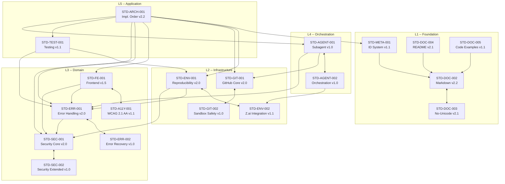

<p align="center">
  
</p>

# Z.ai Agent Toolkit

[]()
[](https://opensource.org/licenses/MIT)
[]()

**Standards + Skills + Rules** for AI-driven development

> Toolkit version: **v2.0.4** | Language: **English**

---

## What Is This

Z.ai Agent Toolkit is a self-contained set of governance documents, operational templates, and behavioral instructions that ensure AI agents produce consistent, clean, and reproducible code and documentation across projects.

It solves three problems:

1. **Inconsistency** -- different agents format code and docs differently
2. **Unicode pollution** -- emoji and Unicode symbols creeping into source code and docs
3. **Reproducibility** -- projects that break on clone because of hardcoded paths and missing env vars

---

## Important: Read-Only Usage

> Z.ai Agent Toolkit is intended for read-only use as a reference.

When cloning into your project, **add to `.gitignore`**:

```gitignore
# Z.ai Agent Toolkit — read-only reference
zai-agent-toolkit/
```

### Why this matters:

1. **Toolkit is a reference**, not part of your code
2. **Agents should not commit changes** to zai-agent-toolkit
3. **Avoid conflicts** when updating the toolkit
4. **Vercel deployment fails** if toolkit is added as git submodule

---

## Quick Start

> **Full installation guide:** See [INSTALL.md](INSTALL.md) for ZCode Desktop, Vercel, and other platforms.

### Option A: Global Install for ZCode Desktop (recommended)

```bash
# 1. Clone toolkit to global location
mkdir -p ~/.zcode
cd ~/.zcode
git clone https://github.com/stsgs1980/Zai-agent-toolkit_v.git

# 2. Create symlinks (ZCode Desktop reads from these paths)
ln -s ~/.zcode/Zai-agent-toolkit_v/skills ~/.zcode/skills
ln -s ~/.zcode/Zai-agent-toolkit_v/instructions ~/.zcode/instructions
ln -s ~/.zcode/Zai-agent-toolkit_v/standards ~/.zcode/standards

# 3. Update
cd ~/.zcode/Zai-agent-toolkit_v && git pull origin main
```

### Option B: Copy to Project

```bash
git clone https://github.com/stsgs1980/Zai-agent-toolkit_v.git
cp Zai-agent-toolkit_v/standards/*.md your-project/standards/
```

### Option C: Single Document

Download only the standard you need from the `standards/` directory.

---

## Implementation Order

**Do not apply standards randomly.** There is a mandatory 6-step sequence.

Each step builds on the previous one. Violating the order causes rework.

```text
Step 1: Accept Standards (Group B)      Read, understand, define stack
         |
         v
Step 2: Deploy Worklog (Group A)        Copy templates, verify against B
         |
         v
Step 3: REPRODUCIBILITY                 Configure env, DB, paths
         |                              Log to WORKLOG
         v
Step 4: Unicode Policy [C]           ESLint rule + UI code cleanup
         |                              Log to WORKLOG
         v
Step 5: MARKDOWN_STANDARD [W]           .md file cleanup (incl. Group A)
         |                              Log to WORKLOG
         v
Step 6: README_TEMPLATE                 Assemble README from template
                                        Log to WORKLOG
```

Full details: see `standards/IMPLEMENTATION_ORDER.md`

---

## Repository Structure

```text
zai-agent-toolkit/
  AGENT_RULES.md              Behavioral rules for AI agents
  PROJECT_CONFIG.md           Project-specific settings (stack, server, paths)
  README.md                   This file

  assets/                     Visual assets
    logo.png                  Main logo (1024x1024)
    logo-banner.png           README banner (1344x768)
    favicon.png               Browser favicon (64x64)

  standards/                  Group B: Governance documents (apply first)
    MARKDOWN_STANDARD.md      Markdown formatting
    UNICODE_POLICY.md         Unicode/emoji prohibition
    README_TEMPLATE.md        Mandatory README structure
    REPRODUCIBILITY-STANDARD.md Clone + install + dev = works
    IMPLEMENTATION_ORDER.md   Implementation sequence
    STANDARD_ID_SYSTEM.md     Standard ID registry
    CODE_EXAMPLES_GUIDE.md    Code examples formatting
    FRONTEND_STANDARD.md      Frontend development
    GITHUB_STANDARD.md        Git/GitHub core operations
    GITHUB_SANDBOX_STANDARD.md Sandbox git safety
    WCAG_2.1_AA_STANDARD.md   Accessibility WCAG 2.1 AA
    TESTING_STANDARD.md       Unit, integration, E2E testing
    ERROR_HANDLING_STANDARD.md Error handling core
    ERROR_RECOVERY_STANDARD.md Error recovery (retry, circuit breaker)
    SECURITY_STANDARD.md      Security core (secrets, validation)
    SECURITY_EXTENDED_STANDARD.md Security extended (auth, RBAC)
    SUBAGENT_STANDARD.md      Subagent types and contract
    ORCHESTRATION_STANDARD.md Multi-agent coordination

  agents/                    Subagent templates (STD-AGENT-001 compliant)
    templates/
      task-prompt-template.md  Prompt templates for all subagent types
      context-handoff-template.md  Multi-session handoff template
      subagent-result-template.md  Result reporting template

  templates/                  Group A: Operational templates (deploy after B)
    WORKLOG.md                Agent work journal
    TASK_TEMPLATE.md          Sub-agent prompt templates
    README_WORKLOG.md         Worklog system guide

  instructions/               Detailed behavioral instructions
    onboarding-protocol.md    What to do when entering a project
    git-workflow-rules.md     Safe git operations in sandbox
    language-rule.md          Always match user's language
    diagnostic-disclosure.md  Never assert data loss without verification
    writing-plans.md          Plan before you code
    sandbox-rules.md          Sandbox environment behaviors
    zai-sdk-guidelines.md     Z.ai SDK development rules

  skills/                     Automated agent skills
    commit-work/              High-quality conventional commits
    context-consolidation/    Context and memory management
    database-schema-designer/ Database schema design
    folder-indexer/           File and folder navigation
    frontend-styling-expert_sts/ CSS and styling specialist
    memory-delete/            Delete memory entries
    memory-export/            Export memory to JSON
    memory-query/             Semantic memory search
    memory-store/             Store knowledge in ChromaDB
    mermaid-diagrams/         Software diagrams with Mermaid
    performance-code-generator_sts/ High-performance code generation
    phi-layout_sts/           Proportional CSS Grid layouts
    project-clone/            Smart project cloning
    prompt-engineering_sts/   Prompt scoring and architecture
    qa-test-planner/          QA test planning
    requirements-clarity/     Clarify requirements before coding
    session-log/              Session knowledge capture
    skill-creator/            Create new skills
    skill-id-system/          Skill ID assignment system
    sync-toolkit_sts/         Toolkit sync between server and Windows
    zai-ui-composer_sts/      Production UI composition
```

---

## Document Classification

### Group B -- Governance (standards)

These define rules. They are read and accepted, not modified per project.

| ID | Document | Level | Scope |
|----|----------|-------|-------|
| STD-DOC-002 | `MARKDOWN_STANDARD.md` | [W] | README, project documentation |
| STD-DOC-003 | `UNICODE_POLICY.md` | [C]+[W]+[I] | UI code [C], AI-chat + docs [W], prototypes [I] |
| STD-DOC-004 | `README_TEMPLATE.md` | [W] | Mandatory README structure |
| STD-DOC-005 | `CODE_EXAMPLES_GUIDE.md` | [W] | Code examples in documentation |
| STD-ENV-001 | `REPRODUCIBILITY-STANDARD.md` | [C] | Environment, paths, DB |
| STD-ENV-002 | `ZAI_INTEGRATION_STANDARD.md` | [C] | Z.ai sandbox integration |
| STD-ARCH-001 | `IMPLEMENTATION_ORDER.md` | [W] | 6-step implementation sequence |
| STD-META-001 | `STANDARD_ID_SYSTEM.md` | [W] | Standard ID registry and rules |
| STD-FE-001 | `FRONTEND_STANDARD.md` | [C] | React/Next.js frontend development |
| STD-GIT-001 | `GITHUB_STANDARD.md` | [C] | Git core operations, commit format, branching |
| STD-GIT-002 | `GITHUB_SANDBOX_STANDARD.md` | [C] | Sandbox git safety, deadlock recovery |
| STD-A11Y-001 | `WCAG_2.1_AA_STANDARD.md` | [C] | UI accessibility compliance |
| STD-TEST-001 | `TESTING_STANDARD.md` | [C] | Unit, integration, E2E testing |
| STD-ERR-001 | `ERROR_HANDLING_STANDARD.md` | [C] | Error handling, logging, response patterns |
| STD-ERR-002 | `ERROR_RECOVERY_STANDARD.md` | [C] | Error recovery, retry, circuit breaker |
| STD-SEC-001 | `SECURITY_STANDARD.md` | [C] | Core security: secrets, validation, headers |
| STD-SEC-002 | `SECURITY_EXTENDED_STANDARD.md` | [C] | Extended: auth, RBAC, rate limiting, compliance |
| STD-AGENT-001 | `SUBAGENT_STANDARD.md` | [C] | Subagent types, contract, lifecycle |
| STD-AGENT-002 | `ORCHESTRATION_STANDARD.md` | [C] | Multi-agent coordination, dependencies |

### Group A -- Operational (templates)

These are deployed into a project. They SUBMIT to Group B standards.

| Document | Purpose |
|----------|---------|
| `WORKLOG.md` | Agent work journal (live file) |
| `TASK_TEMPLATE.md` | Sub-agent prompt templates |
| `README_WORKLOG.md` | Worklog system guide |

### Infrastructure

| Document | Purpose |
|----------|---------|
| `AGENT_RULES.md` | Behavioral rules (universal) |
| `PROJECT_CONFIG.md` | Project-specific settings (per project) |
| `instructions/*.md` | Detailed behavioral instructions |

---

## Standards Interaction Map

> **Overview** -- this graph shows Cross-References between all 19 standards grouped by domain.
> For exact section references, see the Cross-References table in each standard file.



---

## Key Rules Summary

### Unicode Policy

- No emoji or Unicode graphic characters in source code, UI text, or AI chat responses
- `(ref)` exception: identification symbols in tables and code blocks
- Typographic characters (em dash, copyright, degree) allowed in plain text
- User messages in chat are NOT regulated
- Levels: [C] for code/UI, [W] for AI-chat and documentation

### MARKDOWN_STANDARD

- ASCII + Cyrillic + typographic characters in text
- No Unicode in headings, code, or tables (except `(ref)`)
- 4 backticks for nested code blocks
- Language tags required on all code blocks
- Dash `-` for unordered lists (not `*` or `+`)
- Stack signature: `Built with: <project technologies>`

### REPRODUCIBILITY

- `.env.example` required with all variables
- Relative paths only (no `/home/`, `http://localhost:`)
- `connection_limit=1` for SQLite
- `clone + install + dev = works`

---

## Toolkit Versioning

| Component | ID | Version |
|-----------|----|---------|
| **Toolkit** | -- | **v2.0.4** |
| MARKDOWN_STANDARD | STD-DOC-002 | v2.2.0 |
| UNICODE_POLICY | STD-DOC-003 | v2.1.3 |
| README_TEMPLATE | STD-DOC-004 | v2.1 |
| CODE_EXAMPLES_GUIDE | STD-DOC-005 | v1.1 |
| REPRODUCIBILITY-STANDARD | STD-ENV-001 | v2.0 |
| ZAI_INTEGRATION_STANDARD | STD-ENV-002 | v1.1 |
| IMPLEMENTATION_ORDER | STD-ARCH-001 | v2.2 |
| STANDARD_ID_SYSTEM | STD-META-001 | v1.1 |
| FRONTEND_STANDARD | STD-FE-001 | v1.5 |
| GITHUB_STANDARD | STD-GIT-001 | v2.0 |
| GITHUB_SANDBOX_STANDARD | STD-GIT-002 | v1.0 |
| WCAG_2.1_AA_STANDARD | STD-A11Y-001 | v1.1 |
| TESTING_STANDARD | STD-TEST-001 | v1.1 |
| ERROR_HANDLING_STANDARD | STD-ERR-001 | v2.0 |
| ERROR_RECOVERY_STANDARD | STD-ERR-002 | v1.0 |
| SECURITY_STANDARD | STD-SEC-001 | v2.0 |
| SECURITY_EXTENDED_STANDARD | STD-SEC-002 | v1.0 |
| SUBAGENT_STANDARD | STD-AGENT-001 | v1.0 |
| ORCHESTRATION_STANDARD | STD-AGENT-002 | v1.0 |
| WORKLOG / TASK_TEMPLATE / README_WORKLOG | -- | v2.1.1 |

When updating individual standards, update the toolkit version in `AGENT_RULES.md` and `README.md`.

---

## Configuration

After copying the toolkit to your project, edit **`PROJECT_CONFIG.md`**:

1. Set your stack signature (e.g., `Built with: React + Python + PostgreSQL`)
2. Set your dev server command and port
3. Set your project paths

`AGENT_RULES.md` references `PROJECT_CONFIG.md` for all project-dependent settings, so you never need to modify the agent rules themselves.

---

## Readiness Checklist

What you get after importing this toolkit, and what still needs manual setup.

### Works out of the box

When `AGENT_RULES.md` is connected as agent instructions / system prompt:

- **Behavioral rules** -- file handling, formatting, No-Unicode, reproducibility are all defined
- **Standard references** -- agent knows MARKDOWN_STANDARD, No-Unicode Policy, REPRODUCIBILITY exist and where to find them
- **Onboarding protocol** -- agent reads required files on session start
- **Document classification** -- Group A / Group B hierarchy is understood
- **Git safety** -- backup before rewrite, force-push over rebase, panic diagnostics ladder

### Requires one-time setup per project

| Action | Time | Details |
|--------|------|---------|
| Edit `PROJECT_CONFIG.md` | 2-3 min | Stack signature, dev server command, project paths |
| Copy `WORKLOG.md` to project root | 10 sec | `cp templates/WORKLOG.md your-project/worklog.md` |
| Copy `TASK_TEMPLATE.md` to project root | 10 sec | `cp templates/TASK_TEMPLATE.md your-project/` |

### Known limitations

| Issue | Impact | Priority |
|-------|--------|----------|
| `setup.sh` not yet tested against current file structure | Templates copied manually | Medium |

---

## License

This toolkit is provided as-is for use with AI-driven development workflows.

---

## Changelog

See [CHANGELOG.md](CHANGELOG.md) for full version history.

---

Built with: Python + PowerShell + Markdown
