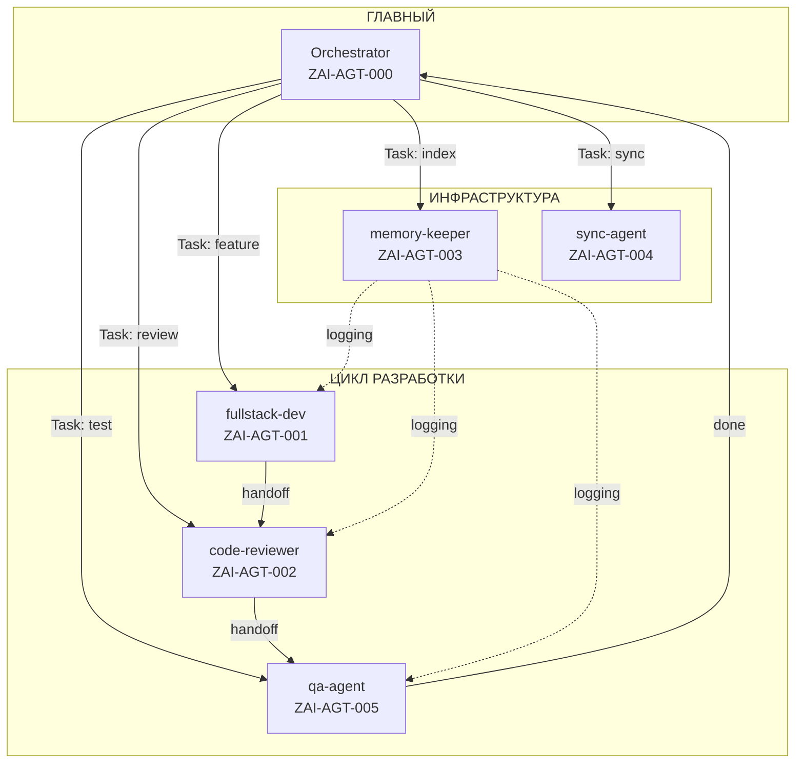
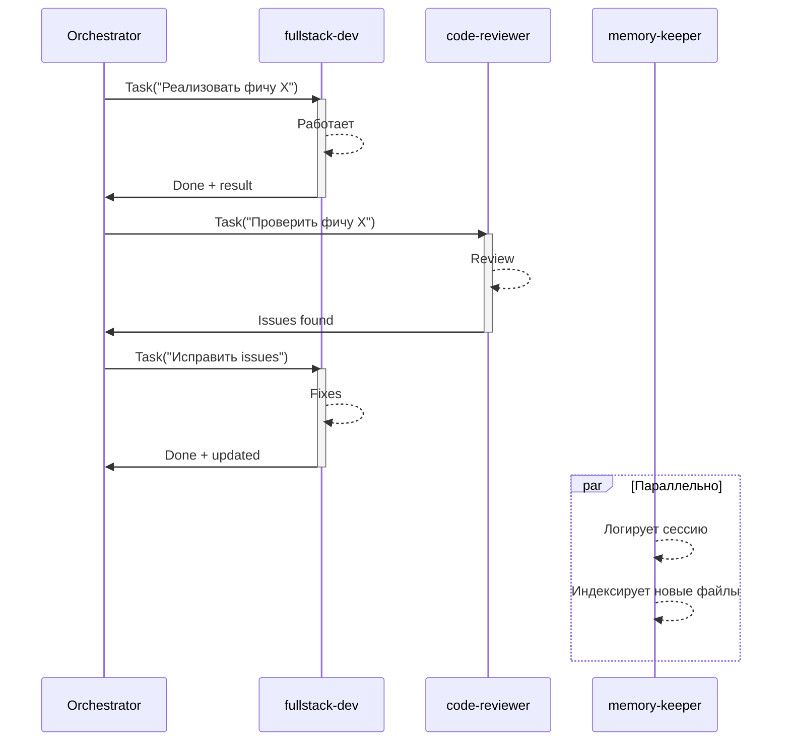
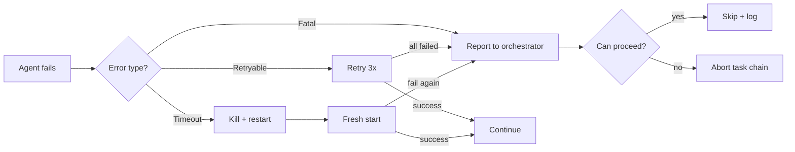
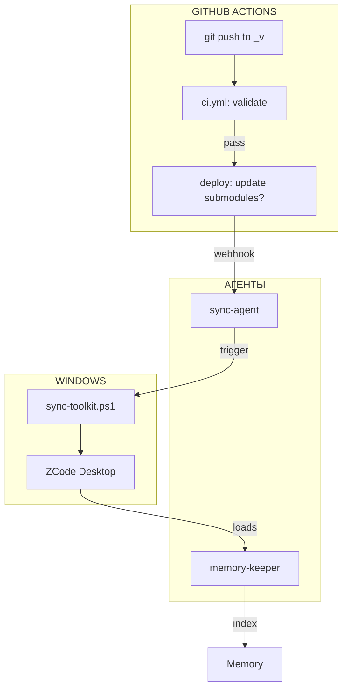
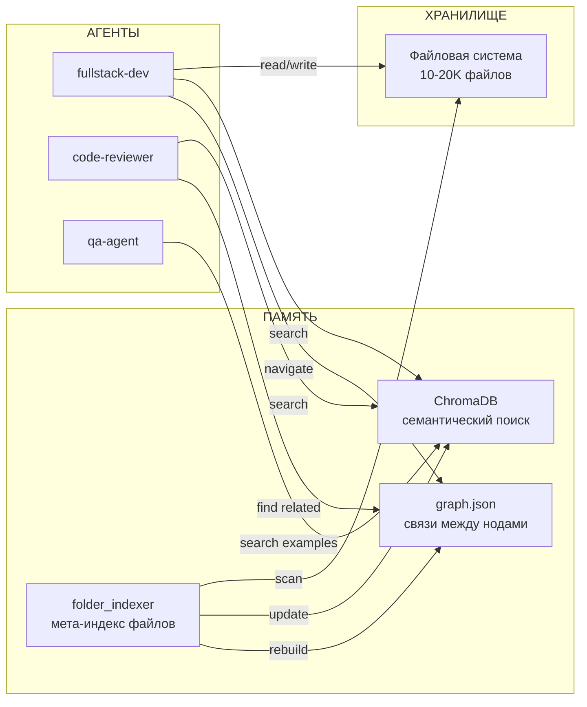
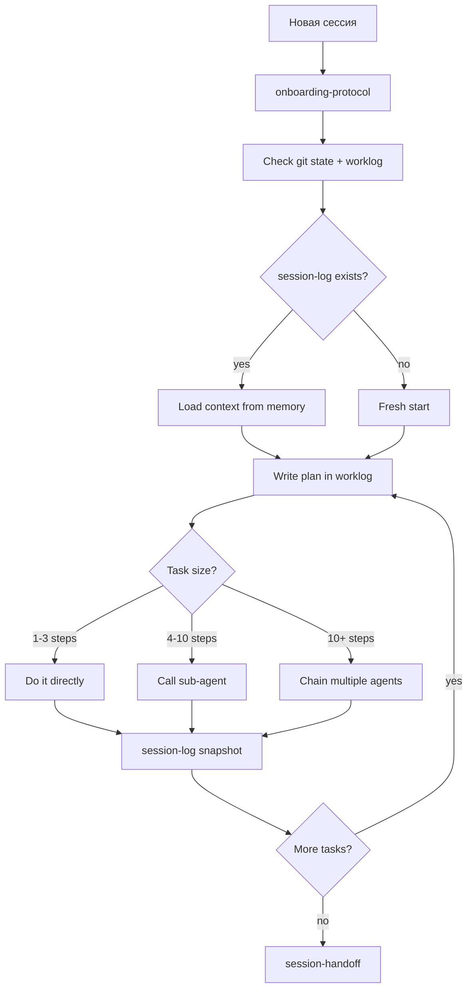

# Agent Architecture: Z.ai Agent Toolkit

> Реестр, протоколы, конфигурация, связка с системой
> Версия: v1 (PROPOSED)

---

## 1. Общая архитектура

```mermaid
graph TB
    subgraph Orchestrator["ОРКЕСТРАТОР (main agent)"]
        O[Agent Core]
        OW[Worklog]
        OM[Memory: ChromaDB + Graph]
    end

    subgraph Registry["РЕЕСТР АГЕНТОВ"]
        FA[fullstack-dev]
        CR[code-reviewer]
        MK[memory-keeper]
        SA[sync-agent]
        QA[qa-agent]
    end

    subgraph Skills["НАВЫКИ (skills/)"]
        S5[phi-layout_sts]
        S6[zai-ui-composer_sts]
        S7[session-log]
        S8[memory-store]
        S9[prompt-engineering_sts]
    end

    subgraph System["СИСТЕМНЫЕ КОМПОНЕНТЫ"]
        CI[CI/CD: GitHub Actions]
        MEM[Memory: ChromaDB + folder_indexer + graph.json]
        SYNC[Sync: Windows <-> GitHub <-> Sandbox]
        DOCS[Standards + Instructions]
    end

    O -->|Task() call| FA
    O -->|Task() call| CR
    O -->|Task() call| MK
    O -->|Task() call| SA
    O -->|Task() call| QA

    FA --> S5
    FA --> S6
    MK --> S7
    MK --> S8
    CR --> S9

    FA --> OW
    CR --> OW
    MK --> OW
    QA --> OW

    MK --> MEM
    SA --> SYNC
    CI -->|validates| DOCS
    FA -->|follows| DOCS
    CR -->|follows| DOCS
```

---

## 2. Реестр агентов (Registry)

### 2.1 Формат AGENT.md

Каждый агент — директория в `agents/` с файлом `AGENT.md`:

```yaml
---
role: fullstack-dev
id: ZAI-AGT-001
version: 1.0
compatibility: sandbox
parent: orchestrator
skills:
  - frontend-styling-expert_sts
  - phi-layout_sts
  - database-schema-designer
handoff: worklog+artifacts
lifecycle: on-demand
trigger: feature, bugfix, refactor
---
```

### 2.2 Таблица агентов

| ID | Роль | parent | Skills | Триггер |
|----|------|--------|--------|---------|
| ZAI-AGT-001 | `fullstack-dev` | orchestrator | frontend-styling, phi-layout, database-schema, zai-ui-composer | feature, bugfix |
| ZAI-AGT-002 | `code-reviewer` | orchestrator | prompt-engineering_sts, mermaid-diagrams | review, refactor |
| ZAI-AGT-003 | `memory-keeper` | orchestrator | memory-store, memory-query, session-log, folder-indexer | session-end, periodic |
| ZAI-AGT-004 | `sync-agent` | orchestrator | sync-toolkit_sts | sync-toolkit, push, pull |
| ZAI-AGT-005 | `qa-agent` | orchestrator | qa-test-planner, performance-code-generator_sts | test, deploy |

### 2.3 Иерархия агентов



---

## 3. Протоколы общения (Protocols)

### 3.1 Task() — вызов суб-агента

Уже есть в `templates/TASK_TEMPLATE.md`:

```javascript
Task({
  description: "Implement auth feature",
  prompt: `
Task ID: **AUTH-001**

## WORKLOG
1. Read /home/z/my-project/worklog.md
2. After work add entry (DO NOT overwrite!)

## CONTEXT
- Feature: JWT authentication
- Files: src/auth/*.ts, src/middleware.ts
- Depends on: DB schema task (DB-001)

## TASK
Implement login/logout/register endpoints
  `,
  subagent_type: "fullstack-developer"
});
```

### 3.2 Handoff — передача результатов



### 3.3 Протокол артефактов

Что передаётся между агентами:

```json
{
  "task_id": "AUTH-001",
  "status": "completed",
  "artifacts": {
    "files_created": ["src/auth/login.ts", "src/auth/register.ts"],
    "files_modified": ["src/middleware.ts"],
    "test_coverage": 85,
    "decisions": [
      "JWT with RS256, 15min access + 7d refresh",
      "bcrypt for password hashing"
    ],
    "worklog_entry": "---\nTask ID: AUTH-001\n..."
  },
  "handoff_to": "code-reviewer"
}
```

### 3.4 Протокол ошибок



---

## 4. Конфигурация (Configuration)

### 4.1 opencode.json

```json
{
  "$schema": "https://opencode.ai/config.json",
  "skills": {
    "paths": ["skills"]
  },
  "agents": {
    "paths": ["agents"],
    "default": "orchestrator",
    "lifecycle": {
      "max_idle_minutes": 30,
      "max_retries": 3,
      "timeout_seconds": 300
    }
  },
  "memory": {
    "chromadb_path": "~/.zcode/memory/chromadb",
    "graph_path": "~/.zcode/memory/graph.json",
    "auto_index": true
  }
}
```

### 4.2 Структура agents/

```text
agents/
  AGENTS.md                  <- Реестр (этот документ)
  orchestrator/
    AGENT.md                 <- Инструкция оркестратора
  fullstack-dev/
    AGENT.md
    rules/
      react-patterns.md      <- Доп. правила для этого агента
  code-reviewer/
    AGENT.md
  memory-keeper/
    AGENT.md
  sync-agent/
    AGENT.md
  qa-agent/
    AGENT.md
```

### 4.3 Пример AGENT.md (fullstack-dev)

```markdown
---
role: fullstack-dev
id: ZAI-AGT-001
version: 1.0
compatibility: sandbox
parent: orchestrator
skills:
  - frontend-styling-expert_sts
  - phi-layout_sts
  - database-schema-designer
  - zai-ui-composer_sts
  - mermaid-diagrams
handoff: worklog+artifacts
lifecycle: on-demand
trigger: feature, bugfix, refactor
---

# Agent: Fullstack Developer v1.0

> ID: ZAI-AGT-001
> Skills: frontend-styling, phi-layout, database-schema, zai-ui-composer, mermaid
> Handoff: worklog.md + artifacts.json

...

## Workflow

1. Read worklog.md for context
2. Implement according to standards/
3. After work: update worklog.md, return artifacts
```

---

## 5. Связка с системой (Integration)

### 5.1 CI/CD



### 5.2 Память + агенты



### 5.3 Жизненный цикл сессии



### 5.4 Матрица агент → навык → стандарт

| Агент | Использует навыки | Подчиняется стандартам |
|-------|------------------|----------------------|
| `fullstack-dev` | frontend-styling, phi-layout, database-schema, zai-ui-composer, mermaid | FRONTEND_STANDARD, MARKDOWN_STANDARD, GITHUB_STANDARD, TESTING_STANDARD |
| `code-reviewer` | prompt-engineering_sts, mermaid-diagrams | FRONTEND_STANDARD, ERROR_HANDLING, SECURITY_STANDARD |
| `memory-keeper` | memory-store, memory-query, session-log, folder-indexer | REPRODUCIBILITY, ZAI_INTEGRATION |
| `sync-agent` | sync-toolkit_sts | GITHUB_STANDARD |
| `qa-agent` | qa-test-planner, performance-code-generator_sts | TESTING_STANDARD, ERROR_HANDLING |

---

## 6. Что нужно сделать для реализации

| # | Задача | Зависит от |
|---|--------|-----------|
| 1 | Создать `agents/` директорию + AGENTS.md | — |
| 2 | Написать AGENT.md для каждого агента (5 шт) | п.1 |
| 3 | Обновить `opencode.json` — добавить `agents.paths` | п.1 |
| 4 | Обновить `templates/TASK_TEMPLATE.md` — добавить chain-шаблоны | — |
| 5 | Доработать `AGENT_RULES.md` — добавить Section про sub-agents | — |
| 6 | Протокол артефактов: создать `templates/ARTIFACTS_TEMPLATE.md` | — |
| 7 | Интегрировать с памятью: агенты пишут в ChromaDB + graph.json | Memory System |
| 8 | CI: добавить валидацию `agents/AGENT.md` frontmatter | CI/CD |
| 9 | Документация в `standards/AGENT_STANDARD.md` | все пункты |

---

*Dokument sozdan: 2026-05-18*

---

Built with: Python + PowerShell + Markdown
