# Skills Process Flows

> Visual documentation for Z.ai Agent Toolkit processes
> Generated: 2026-05-17

---

## 0. Unified Architecture (PlantUML)

**Единая диаграмма всей архитектуры и процессов:**

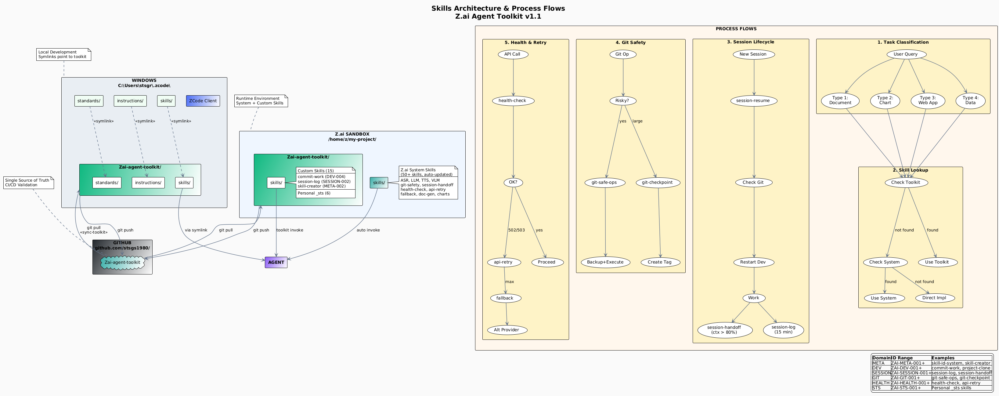

> Source: `diagrams/skills-architecture.puml` — редактируемый PlantUML файл

---

## 1. Skill Selection Flow

Как агент выбирает и вызывает skills в зависимости от типа задачи.

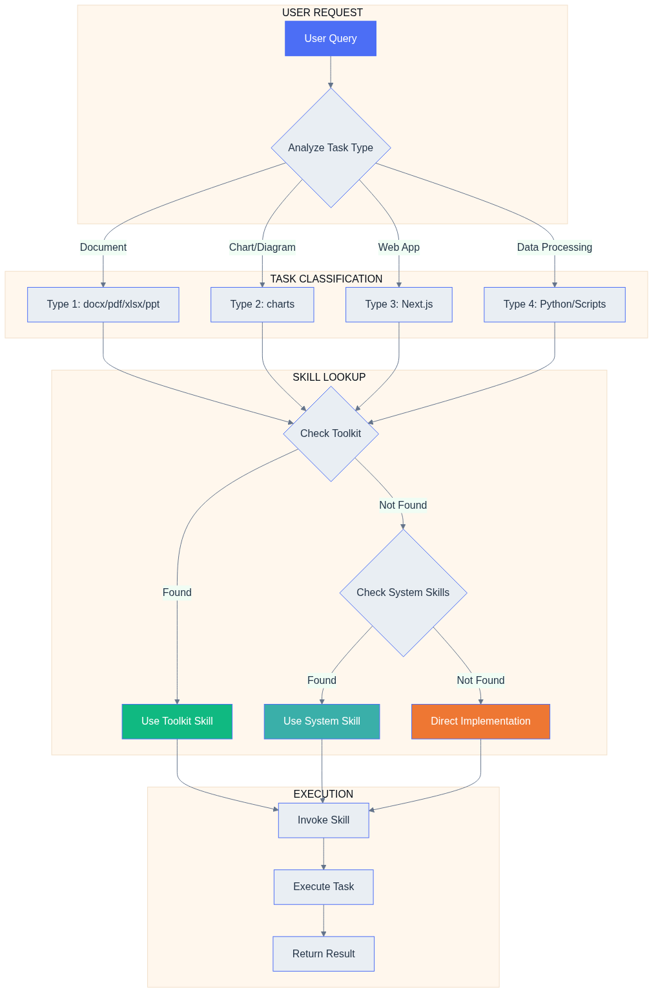

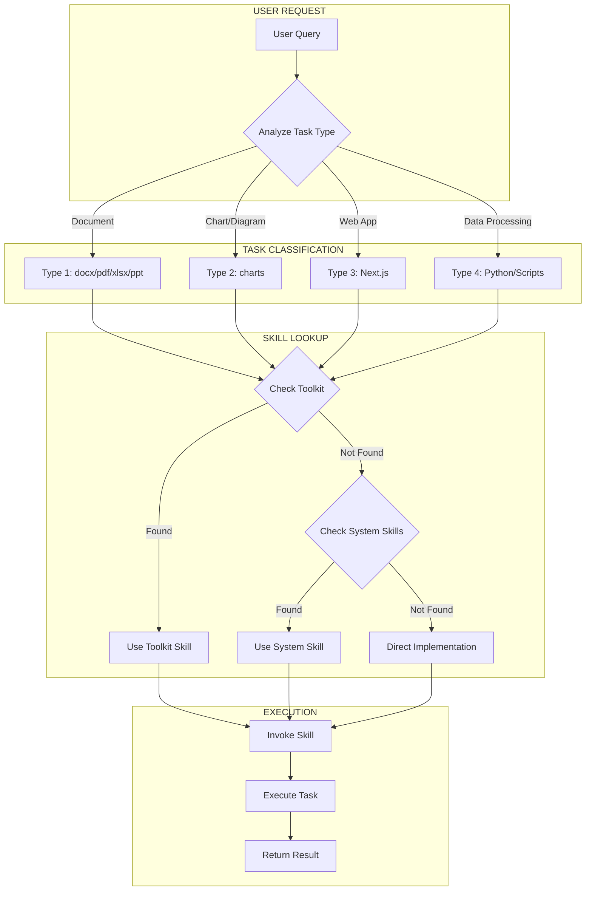

---

## 2. Skill Creation Flow

Процесс создания нового skill с автоматическим назначением ID.

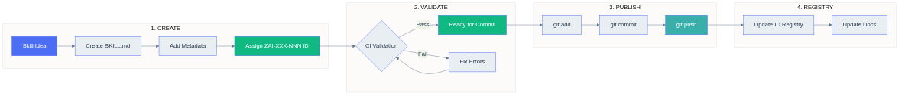

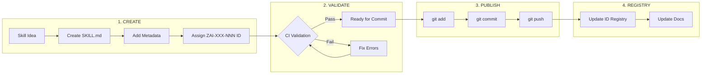

---

## 3. Session Lifecycle

Жизненный цикл сессии с использованием session-resume, session-log, session-handoff.

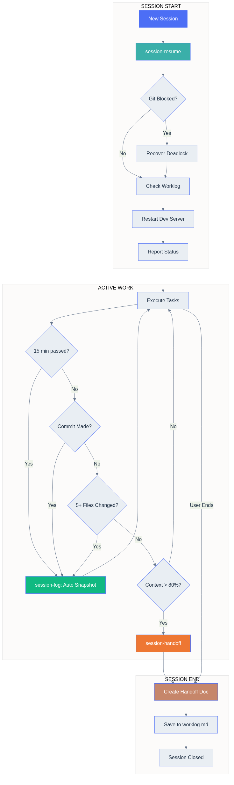

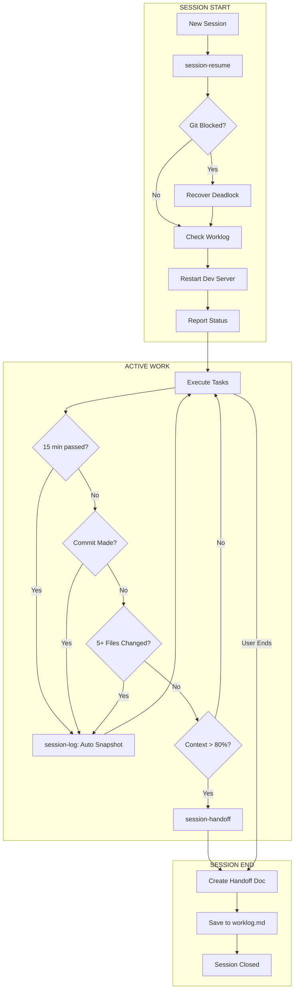

### Skills Used

| Skill | ZAI ID | Trigger |
|-------|--------|---------|
| session-resume | System | New session start |
| session-log | ZAI-SESSION-002 | Every 15 min, after commit, 5+ files |
| session-handoff | System | Context > 80%, session end |

---

## 4. Git Safety Flow

Защита от потери данных при git операциях.

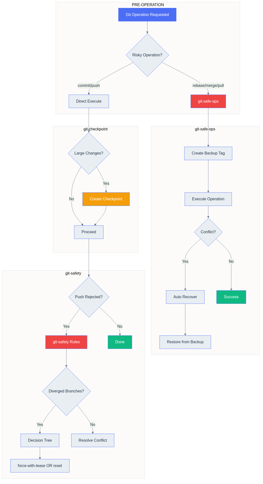

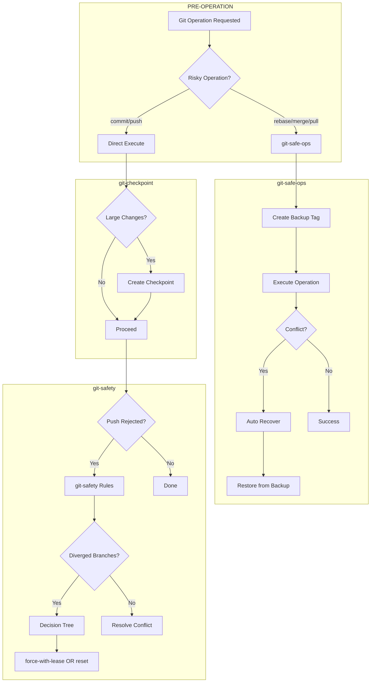

### Skills Used

| Skill | ZAI ID | Purpose |
|-------|--------|---------|
| git-safe-ops | System | Backup + recover for risky ops |
| git-checkpoint | System | Create recovery tag |
| git-safety | System | Deadlock prevention rules |

---

## 5. Health & Retry Flow

Обработка API ошибок с автоматическим retry и fallback.

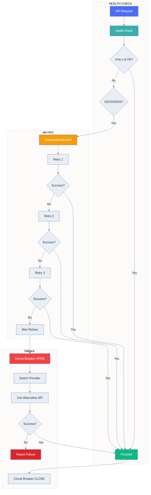

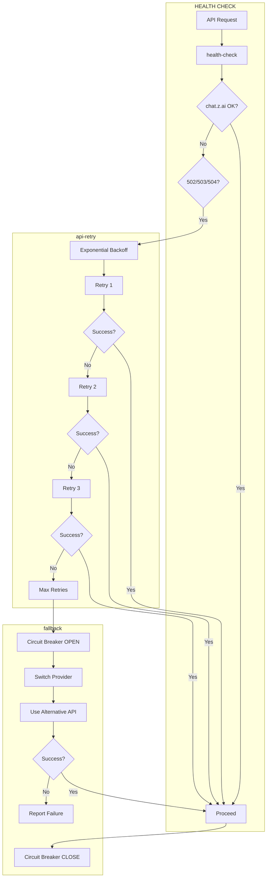

### Skills Used

| Skill | ZAI ID | Purpose |
|-------|--------|---------|
| health-check | System | Check API availability |
| api-retry | System | Exponential backoff retry |
| fallback | System | Switch to alternative provider |

---

## 6. Toolkit vs System Decision

Откуда берётся skill — toolkit или системная директория.

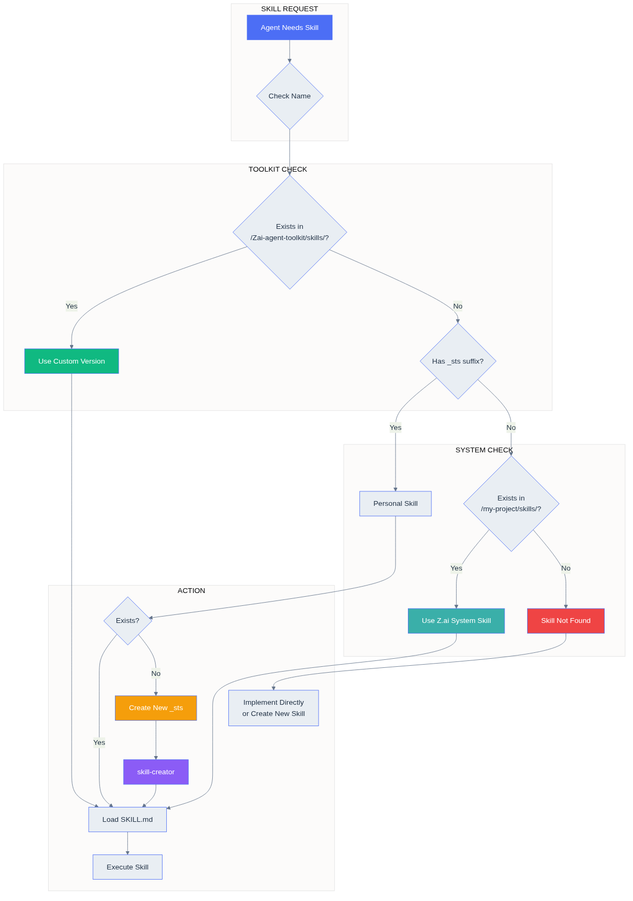

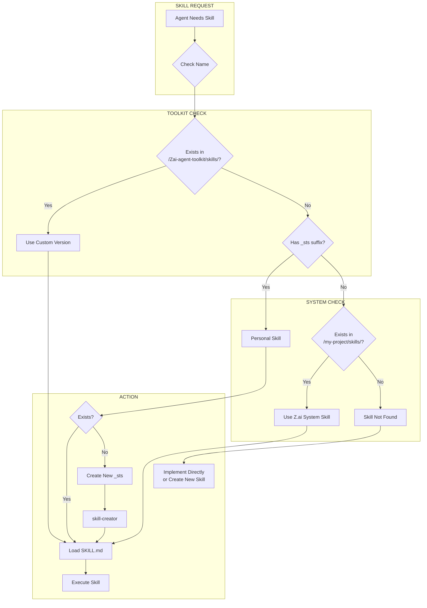

---

## 7. Full Sync Architecture (Windows + GitHub + Sandbox)

Полная архитектура синхронизации между Windows, GitHub и Z.ai Sandbox.

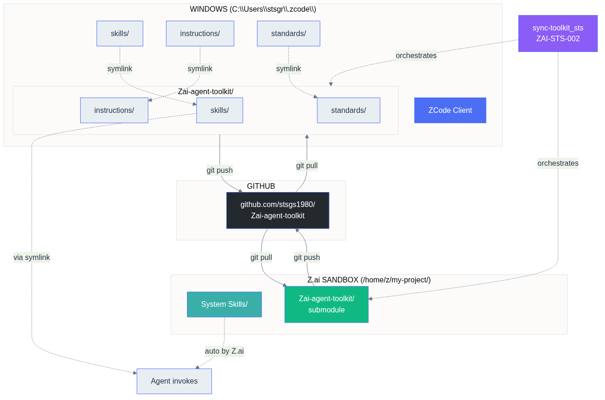

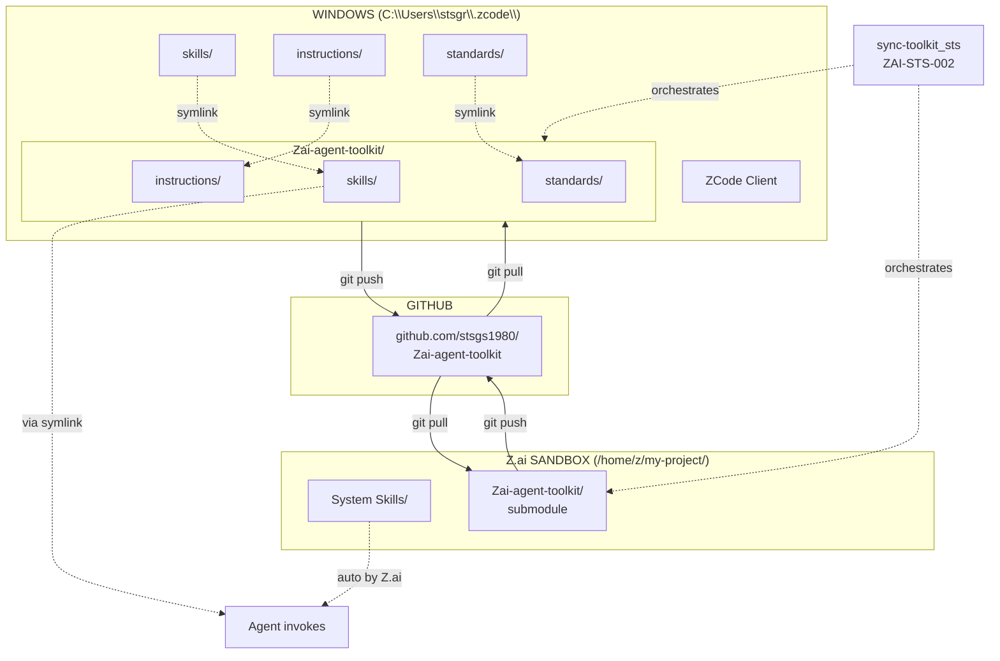

### Windows Directory Structure

```
C:\Users\stsgr\.zcode\
├── agent/
├── cli/
├── v2/
├── skills/ ────────────────→ Zai-agent-toolkit\skills\ (symlink)
├── instructions/ ──────────→ Zai-agent-toolkit\instructions\ (symlink)
├── standards/ ─────────────→ Zai-agent-toolkit\standards\ (symlink)
└── Zai-agent-toolkit/
    ├── skills/
    ├── instructions/
    ├── standards/
    └── sync-toolkit.ps1
```

### Sync Workflow

| Direction | Command | Location |
|-----------|---------|----------|
| Sandbox → GitHub | `git push` | `/home/z/my-project/Zai-agent-toolkit/` |
| GitHub → Windows | `git pull` or `sync-toolkit` | `C:\Users\stsgr\.zcode\Zai-agent-toolkit\` |
| Windows → GitHub | `git push` | `C:\Users\stsgr\.zcode\Zai-agent-toolkit\` |
| GitHub → Sandbox | `git pull` | `/home/z/my-project/Zai-agent-toolkit/` |

### sync-toolkit_sts (ZAI-STS-002)

Personal skill for orchestrating sync between all three locations.

**Triggers:** "sync toolkit", "update toolkit", "obnovit", "lokalno"

---

## Directory Structure Reference

```
/home/z/my-project/
├── skills/                    # Z.ai System Skills (auto-updated)
│   ├── ASR/
│   ├── LLM/
│   ├── git-safety/
│   ├── session-handoff/
│   └── ... (50+ skills)
│
└── Zai-agent-toolkit/
    └── skills/                # Custom Skills (persistent)
        ├── commit-work/        # ZAI-DEV-004
        ├── session-log/        # ZAI-SESSION-002
        ├── skill-creator/      # ZAI-META-002
        └── *_sts/              # Personal skills
```

---

## Quick Reference: Skill IDs

| Domain | ID Range | Examples |
|--------|----------|----------|
| META | ZAI-META-001+ | skill-id-system, skill-creator |
| DEV | ZAI-DEV-001+ | anti-monolith, project-clone, commit-work |
| SEC | ZAI-SEC-001+ | sanitize-validate |
| GIT | ZAI-GIT-001+ | git-safe-ops, git-checkpoint |
| HEALTH | ZAI-HEALTH-001+ | health-check, api-retry, fallback |
| SESSION | ZAI-SESSION-001+ | session-handoff, session-log |
| QA | ZAI-QA-001+ | qa-test-planner |
| REQ | ZAI-REQ-001+ | requirements-clarity |
| ARCH | ZAI-ARCH-001+ | mermaid-diagrams |
| STS | ZAI-STS-001+ | Personal skills (_sts suffix) |
